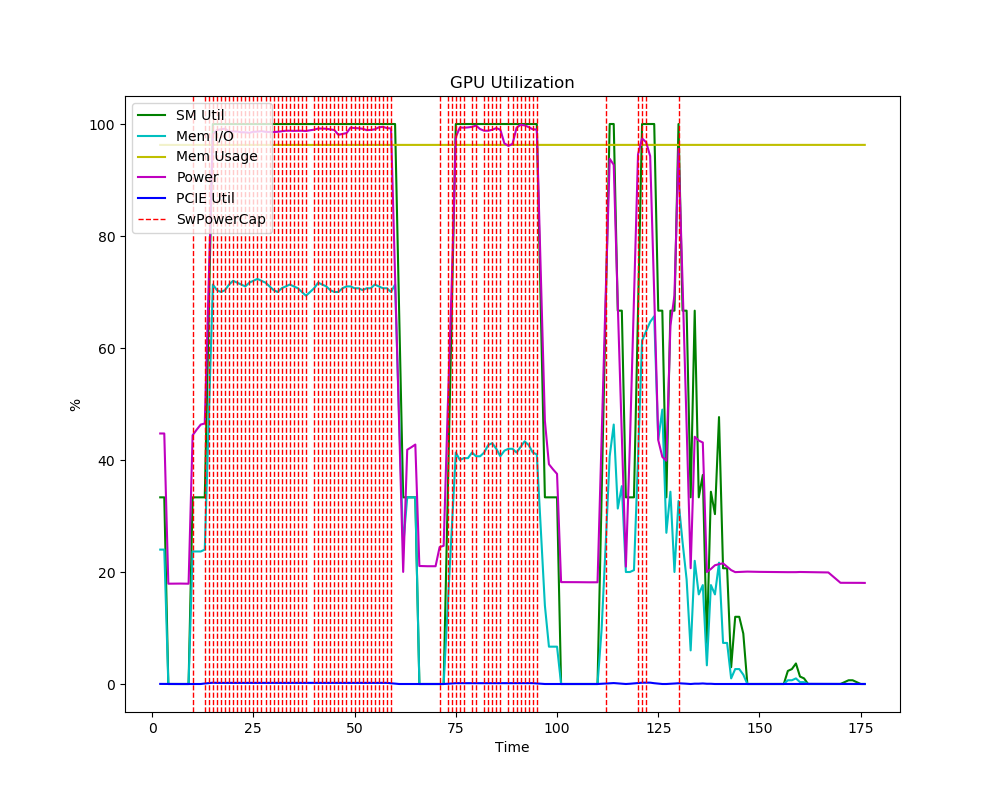
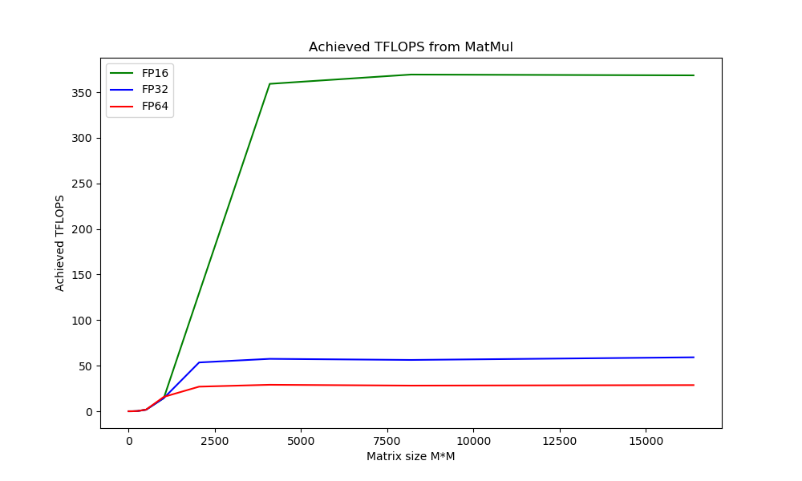
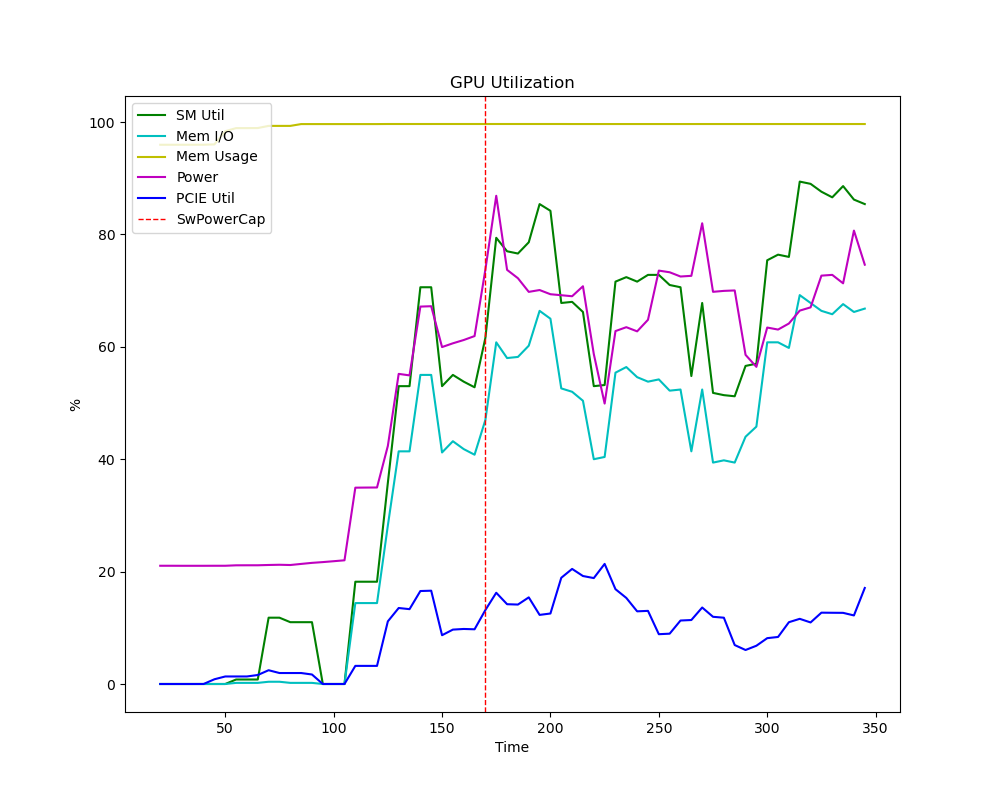
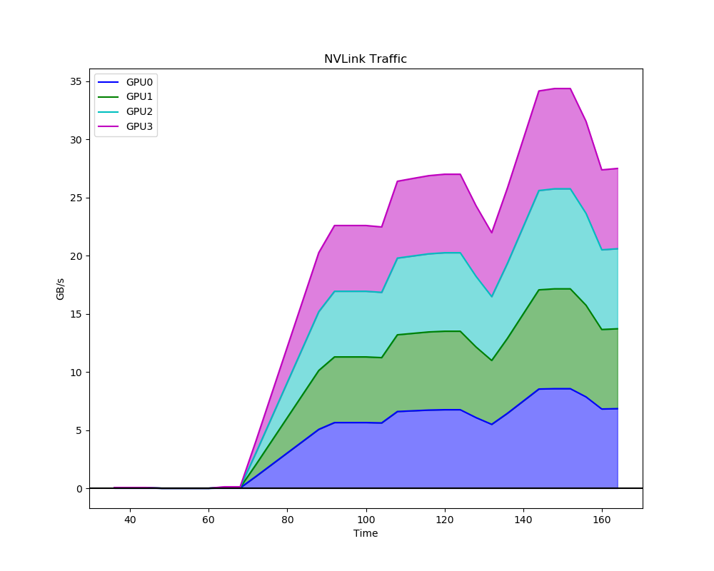
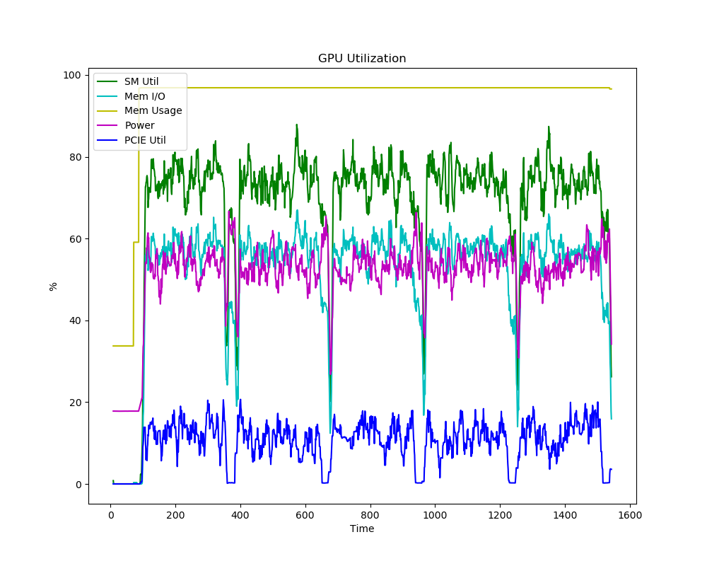
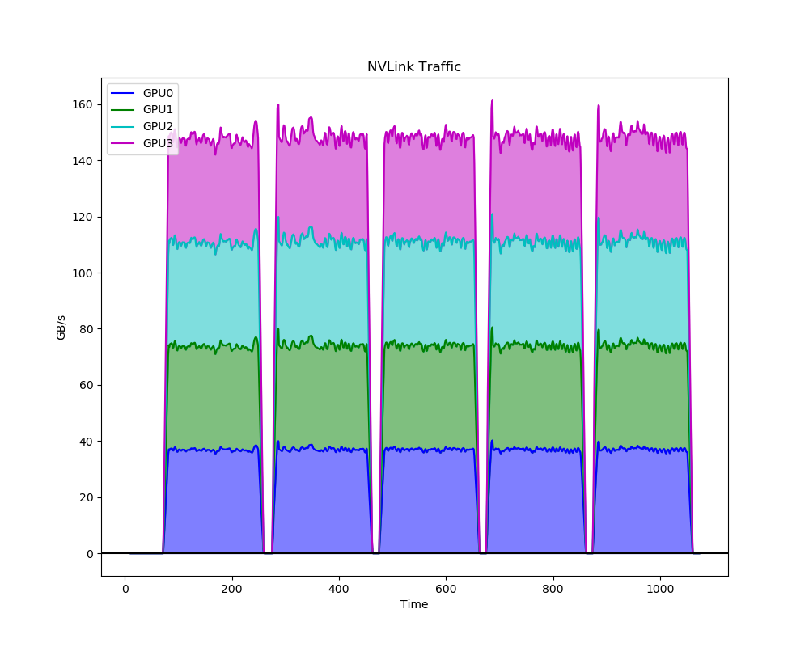

# TensorFlow Benchmarks

## GPU Performance Characterization

Performs a matrix multiplication benchmark test, returning the peak TFLOPS.

```shell
python3 gpu_burn.py
```

```
# 4 V100 (DGX Station)
Maximum TFLOPS achieved on 4 GPUs
=================================
* FP64: 28 TFLOPS
* FP32: 59 TFLOPS
* FP16: 367 TFLOPS
```

| GPU Utilization | TFLOPS Plot |
| --------------- | ----------- |
|  |  |

## Image Classification on Imagenette (smaller ImageNet)

### Test Case 1 ("small CNN")

* Model: ResNet-50
* Framework: TF2.1 + tf.distribute
* Uses NCCL: Yes

```shell
python3 resnet_tfdist.py --amp --xla --batchsize 192 
```

| V100 | Training time | Images/sec | Val Acc |
| ---- | ------------- | ---------- | ------- |
| 4    | 280s          | 4161       | 0.8208  |

| GPU Utilization | NVLink Utilization |
| --------------- | ------------------ |
|  |  |

**DenseNet-201 + Horovod + OpenMPI + NCCL**

### Test Case 2 ("big CNN")

* Model: DenseNet-201
* Framework: TF2.1 + Horovod + OpenMPI
* Uses NCCL: Yes

```shell
mpirun -np 4 \
    -bind-to none -map-by slot \
    -x NCCL_DEBUG=INFO -x LD_LIBRARY_PATH -x PATH \
    -mca pml ob1 -mca btl ^openib \
    python3 resnet_horovod.py --amp --xla \
    --dn201 --imgsize 256 --batchsize 56
```

| V100 | Training time | Images/sec | Val Acc |
| ---- | ------------- | ---------- | ------- |
| 4    | 1056s         | 750        | 0.9241  |

## Transformer Fine-tuning

### Test Case 1 ("big Transformer")

```shell
mpirun -np 4 \
    -bind-to none -map-by slot \
    -x NCCL_DEBUG=INFO -x LD_LIBRARY_PATH -x PATH \
    -mca pml ob1 -mca btl ^openib \
    python3 xfmer_horovod.py \
    --amp  --epochs 1 --batch_size 20 --interval 10 --warmup_prop 0.3 \
    --task qqp --maxseqlen 64 --model xlm-mlm-en-2048 \
    --lr 0.00002
```

| V100 | Training time | Examples/sec | Val Acc |
| ---- | ------------- | ------------ | ------- |
| 4    | 1675s         | 67           | 0.8093  |

| GPU Utilization | NVLink Utilization |
| --------------- | ------------------ |
|  |  |

